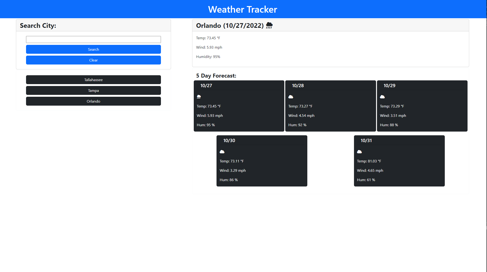

# M6-Weather-Dashboard

## Description

This application uses JavaScript to display the weather in a selected city. When the user types in a city the weather for today and 5 days in the future will appear. The search is added to local storage and a button with all previously searched items will appear. It makes use of 2 API's in order to collect the weather data.
While making this project I learned how to:

- Fetch API's and pull down relevant data
- Work with appending multiple values to a page
- Create, append, and add inner text to an element using JavaScript
- Style using BootStrap and FontAwesome
- Change user input values to be a standard styling. *Ex. ORlaNdO => Orlando*

## Table of Contents

- [Deployment](#deployment)
- [Features](#features)
- [Assignment Instructions](#assignment-instructions)
- [Credits](#credits)
- [License](#license)

## Deployment

### Link

- 

### Screenshot



## Features

- Search a city and relevant weather data is printed to webpage.
- This page is responsive. 
- Notifies user when a city it doesn't know appears.
- The local saved storage is cleared when the button clear is clicked

## Assignment Instructions

### User Story

```
AS A traveler
I WANT to see the weather outlook for multiple cities
SO THAT I can plan a trip accordingly
```

### Acceptance Criteria

```
GIVEN a weather dashboard with form inputs
WHEN I search for a city
THEN I am presented with current and future conditions for that city and that city is added to the search history
WHEN I view current weather conditions for that city
THEN I am presented with the city name, the date, an icon representation of weather conditions, the temperature, the humidity, and the wind speed
WHEN I view future weather conditions for that city
THEN I am presented with a 5-day forecast that displays the date, an icon representation of weather conditions, the temperature, the wind speed, and the humidity
WHEN I click on a city in the search history
THEN I am again presented with current and future conditions for that city
```

## Credits

https://openweathermap.org/forecast5 

## License

MIT License